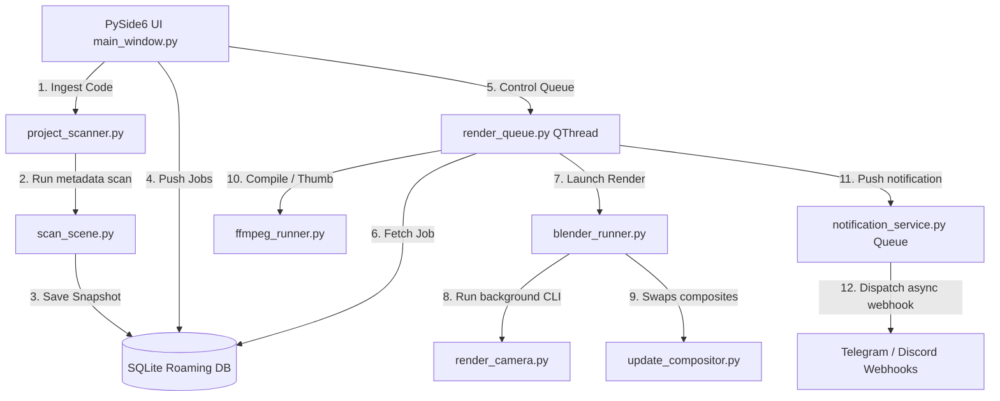
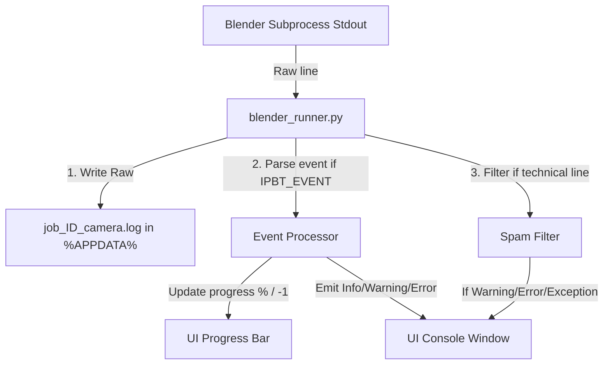

# System Architecture - IP Blender Tool

This document describes the component relationships, MVC layout, and multi-threaded design of **IP Blender Tool**.

---

## 🗺️ Component Relationships

---

## 🧵 Multi-Threading Model

To ensure the user interface remains completely fluid during long rendering sessions, execution is distributed across distinct threads and processes:

### 1. Main UI Thread (PySide6 Event Loop)
- Handles widget rendering, table updates, and user interactions.
- Receives thread-safe Qt Signals from background workers to update progress bars and append logs.
- Never runs heavy file operations or subprocess executions.

### 2. Render Queue Thread (`QThread`)
- Runs a sequential loop in the background.
- Queries SQLite for `Pending` tasks.
- Spawns the `BlenderRunner` and waits synchronously for its return code. This blocks the background thread but leaves the UI thread untouched.

### 3. Subprocesses (CLI execution)
- Spawns standalone `blender.exe` and `ffmpeg.exe` instances.
- Operates in separate OS-level process trees, preventing Blender GUI-related crashes from impacting the management application.

### 4. Notification Outbox Thread (Daemon Thread)
- Consumes a FIFO thread-safe queue.
- Dispatches HTTP requests using connection poolings.
- Has a strict 5-second timeout to isolate rendering operations from network latency.

---

## 🪵 Progress & Logging Pipeline

To achieve clean visual logs and honest progress tracking, the application employs a three-tier pipeline:

### 1. Structured events
Subprocesses emit `IPBT_EVENT {json}` lines. The runner decodes these JSON strings to obtain precise status updates and physical rendering metrics (e.g. Cycles samples, frame indices, preparation phase markers) rather than faking progress.

### 2. Log Segregation
- **Raw logs**: Saved in `%APPDATA%/IP Blender Tool/logs/job_[job_id]_[camera].log` for deep diagnostic inspection.
- **UI console logs**: Filtered to show only important milestones (preflight status, startup, compositor swaps) and warning/error details. Technical Cycles samples and frame metrics are excluded to keep the console clean.
- **Log rotation**: The UI console is limited to the last 500 lines using `setMaximumBlockCount` to prevent memory leaks during long-running tasks.
